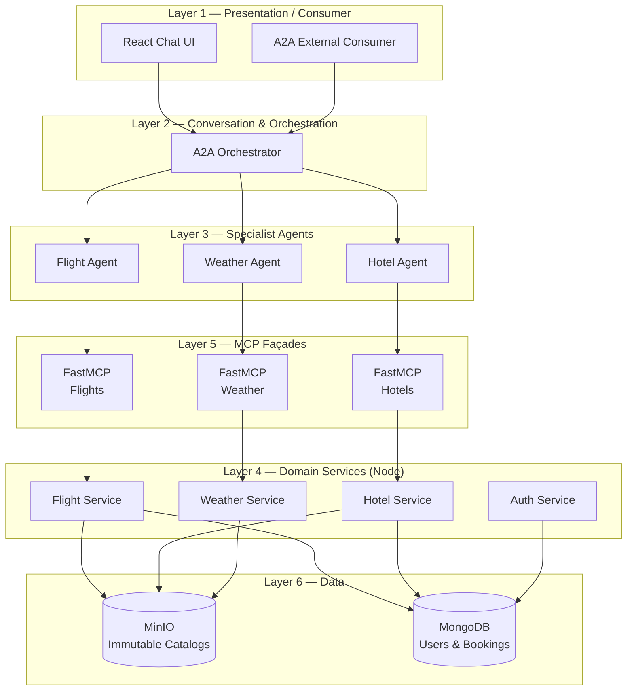

# Smart Travel Agency

> Conversational travel-booking demo showcasing Google A2A agent patterns, domain micro-services and FastMCP façades.

## Key Features

- **End-to-end trip planning in natural language**  
  Book flights, reserve hotels and preview destination weather through a single chat interface.

- **Layered micro-service architecture**  
  Node.js domain services fronted by FastMCP façades feed specialist LLM agents coordinated by an A2A Orchestrator.

- **Clear contracts, easy swaps**  
  OpenAPI 3.1 specs and A2A prompts decouple layers so you can swap data sources, LLM models or deployment targets without rewrites.

## High-Level Architecture

### Layer Breakdown

| # | Layer | Purpose |
|---|-------|---------|
| **1** | Presentation / Consumer | Browser chat UI and REST endpoint for partners. |
| **2** | Conversation & Orchestration | Maintains conversation state, decomposes goals and invokes specialist agents. |
| **3** | Specialist Agent Layer | Domain-aware LLM agents (Flights, Hotels, Weather) that call MCP APIs. |
| **4** | Domain Service Layer | Node.js micro-services implementing business logic and reading datasets. |
| **5** | MCP Server Layer | Auto-generated FastMCP façades enforcing auth, quotas and logging. |
| **6** | Data Layer | MinIO object storage for immutable catalogs and MongoDB for users/bookings. |
