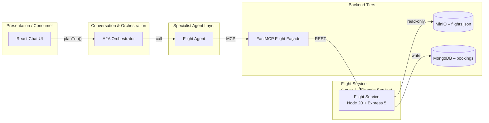

# Flight Service (Node-20 + Express 5) – Design

## 1 Purpose & Scope
The Flight Service provides **flight search and booking capabilities** for the Smart Travel Agency demo. It exposes REST endpoints consumed by the Flight Agent via the FastMCP façade, reads an immutable flight catalogue from MinIO (`flights.json`), and emits booking events to MongoDB.

---

## 2 Position in the Layered Architecture



*The Flight Service is a Layer 4 domain microservice, accessed via a Layer 5 FastMCP façade. It reads flight data from MinIO and (in future) will write bookings to MongoDB.*

---

## 3 API Contract (OpenAPI 3.1 excerpt)

```yaml
paths:
  /flights:
    get:
      summary: Search flights
      parameters:
        - { $ref: "#/components/parameters/origin" }
        - { $ref: "#/components/parameters/destination" }
        - { $ref: "#/components/parameters/departureDate" }
        - { $ref: "#/components/parameters/class" }
      responses:
        "200":
          description: OK
          content:
            application/json:
              schema:
                $ref: "#/components/schemas/FlightList"

  /flights/{flightId}:
    get:
      summary: Get flight details
      parameters:
        - name: flightId
          in: path
          required: true
          schema:
            type: string
            format: uuid
      responses:
        "200":
          description: OK
          content:
            application/json:
              schema:
                $ref: "#/components/schemas/Flight"
        "404":
          $ref: "#/components/responses/NotFound"

  /bookings:
    post:
      summary: Book a seat on a flight
      security:
        - bearerAuth: []
      requestBody:
        required: true
        content:
          application/json:
            schema:
              $ref: "#/components/schemas/BookingRequest"
      responses:
        "201":
          description: Created
          content:
            application/json:
              schema:
                $ref: "#/components/schemas/BookingConfirmation"
        "400":
          $ref: "#/components/responses/BadRequest"
        "401":
          $ref: "#/components/responses/Unauthorized"
        "403":
          $ref: "#/components/responses/Forbidden"
        "409":
          $ref: "#/components/responses/Conflict"
components:
  securitySchemes:
    bearerAuth:
      type: http
      scheme: bearer
      bearerFormat: JWT
```
*Full OpenAPI spec to be included in implementation phase.*

---

### Authentication Flow

1. User logs in via `POST /auth/login` and receives a signed **JWT**.
2. The client includes `Authorization: Bearer <jwt>` on every request.
3. The token is trickled down to the flight service.
4. Flight Service enforces the declared `bearerAuth` security scheme.

## 4 MinIO Data Model – `flights.json`

| Field                | Type    | Notes                                                                 |
|----------------------|---------|-----------------------------------------------------------------------|
| `flight_id`          | uuid    | Primary key                                                          |
| `airline`            | string  | Carrier name                                                         |
| `flight_number`      | string  | Airline + number                                                     |
| `origin` / `destination` | object  | `{ iata, city, country, lat, lon }`                                  |
| `departure_utc` / `arrival_utc` | ISO-8601 | UTC timestamps                                              |
| `duration_min`       | integer | Minutes                                                              |
| `aircraft`           | string  | e.g. “Boeing 787”                                                    |
| `class_fares[]`      | array   | Per cabin class (`Economy`, `Business`): `seats_left`, `price.amount`, `price.currency`, `refundable` |
| `tags[]`             | array   | Optional descriptors (`popular`, `overnight`, `nonstop`)              |

### Read Strategy
- Entire JSON loaded at startup into memory (≈ few MB).
- In-memory filtering for low-latency search.
- Periodic hot-reload or container restart to refresh catalogue.

---

## 5 Search & Filtering Logic

1. Match `origin.iata` == `origin` query param (case-insensitive).
2. Match `destination.iata` == `destination`.
3. Accept flights whose `departure_utc` falls on requested calendar day (local tz conversion deferred to Agent).
4. If `class` provided, ensure at least one fare with `seats_left > 0`.
5. Sort by cheapest fare price ascending, then duration.

---

## 6 Booking Workflow 

1. Validate JWT via shared helper (see Auth design).
2. In a MongoDB **transaction**, `inventory.updateOne({ flight_id, class }, { $inc: { seats_left: -1 } })` is executed. A retry loop (max 3 attempts) handles transient write conflicts.
3. Persist booking document (`userId`, `flight_id`, fare class, price, status) with PNR.
4. Emit webhook / event for downstream notifications.

---

## 7 Error Handling

| Code | Scenario                  | Payload                                 |
|------|---------------------------|-----------------------------------------|
| 400  | Missing / invalid params  | `{ error, details[] }`                  |
| 404  | Flight / class not found  | `{ error }`                             |
| 409  | Insufficient seats        | `{ error, seatsAvailable }`             |
| 500  | Uncaught server error     | `{ error, traceId }`                    |

---
 
## 8 Environment & Configuration Matrix

| Env Var              | Default               | Description                                 |
|----------------------|-----------------------|---------------------------------------------|
| `PORT`               | `4002`                | Port Flight Service listens on              |
| `MINIO_ENDPOINT`     | `http://minio:9000`   | URL for MinIO                               |
| `MINIO_ACCESS_KEY`   | `minio`               | Access key                                  |
| `MINIO_SECRET_KEY`   | `minio123`            | Secret key                                  |
| `MINIO_BUCKET`       | `flights`             | Object key / bucket                         |
| `LOG_LEVEL`          | `info`                | Logging level (`trace` → `error`)           |
| `REQUEST_TIMEOUT_MS` | `30000`               | HTTP request timeout (ms)                   |
| `CORRELATION_HEADER` | `X-Request-Id`        | Correlation header name                     |

---

## 9 Express Boilerplate Conventions

1. `helmet()` – security headers
2. `cors()` – allow all origins (demo)
3. `morgan('combined')` – HTTP access logs
4. **Rate-limit** – 100 req/min per IP
5. **Correlation-Id** middleware – inject / propagate UUID v4
6. Built-in `express.json()` body parser
7. Validation via **Zod** + wrapper middleware
8. `asyncHandler(fn)` wrapper to forward errors
9. Centralised error handler → returns the error envelope (see §7)
10. `notFound` fallback → 404 envelope

---

## 10 Observability – Logs & Metrics

### Log Format
Structured JSON via **pino** with: `time`, `level`, `msg`, `reqId`, `method`, `url`, `status`, `latency_ms`.

### Correlation / ID Propagation
Incoming `X-Request-Id` (or generated) is attached to `req.id` and echoed in every log line **and** the response header.

### Metrics
`/metrics` (Prometheus exposition, `prom-client`) publishing:
• `http_requests_total{route,method,status}`
• `http_request_duration_ms{route}` histogram
• `process_cpu_seconds_total`, `process_memory_bytes`

### Health
`/healthz` returns `200` with `{ status: "ok", uptime, minio: "reachable" }`.

---

## 11 Glossary & References

- **IATA** – International Air Transport Association airport codes.
- **PNR** – Passenger Name Record (booking reference).
- **FastMCP** – OpenAPI-driven façade (see Layer 5 design).
