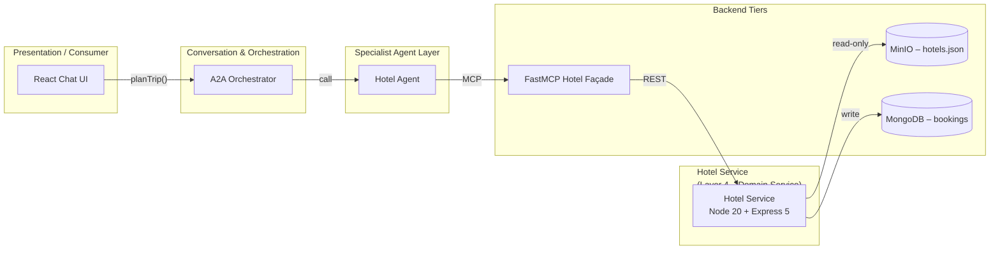

8# Hotel Service (Node-20 + Express 5) – Design

## 1 Purpose & Scope
The Hotel Service provides **hotel search and booking capabilities** for the Smart Travel Agency demo. It exposes REST endpoints consumed by the Hotel Agent via the FastMCP façade, reads an immutable hotel catalogue from MinIO (`hotels.json`), and emits booking events to MongoDB.

---

## 2 Position in the Layered Architecture



*The Hotel Service is a Layer 4 domain microservice, accessed via a Layer 5 FastMCP façade. It reads hotel data from MinIO and (in future) will write bookings to MongoDB.*

---

## 3 API Contract (OpenAPI 3.1 excerpt)

```yaml
paths:
  /hotels:
    get:
      summary: Search hotels
      parameters:
        - name: city
          in: query
          required: false
          schema:
            type: string
        - name: country
          in: query
          required: false
          schema:
            type: string
        - name: checkIn
          in: query
          required: false
          schema:
            type: string
            format: date
        - name: checkOut
          in: query
          required: false
          schema:
            type: string
            format: date
        - name: guests
          in: query
          required: false
          schema:
            type: integer
        - name: amenities
          in: query
          required: false
          schema:
            type: array
            items:
              type: string
        - name: minRating
          in: query
          required: false
          schema:
            type: number
        - name: maxPrice
          in: query
          required: false
          schema:
            type: number
        - name: tags
          in: query
          required: false
          schema:
            type: array
            items:
              type: string
      responses:
        "200":
          description: OK
          content:
            application/json:
              schema:
                $ref: "#/components/schemas/HotelList"

  /hotels/{hotelId}:
    get:
      summary: Get hotel details
      parameters:
        - name: hotelId
          in: path
          required: true
          schema:
            type: string
            format: uuid
      responses:
        "200":
          description: OK
          content:
            application/json:
              schema:
                $ref: "#/components/schemas/Hotel"
        "404":
          $ref: "#/components/responses/NotFound"

  /bookings:
    post:
      summary: Book a room in a hotel
      security:
        - bearerAuth: []
      requestBody:
        required: true
        content:
          application/json:
            schema:
              $ref: "#/components/schemas/BookingRequest"
      responses:
        "201":
          description: Created
          content:
            application/json:
              schema:
                $ref: "#/components/schemas/BookingConfirmation"
        "400":
          $ref: "#/components/responses/BadRequest"
        "401":
          $ref: "#/components/responses/Unauthorized"
        "403":
          $ref: "#/components/responses/Forbidden"
        "409":
          $ref: "#/components/responses/Conflict"
components:
  securitySchemes:
    bearerAuth:
      type: http
      scheme: bearer
      bearerFormat: JWT
```
*Full OpenAPI spec to be included in implementation phase.*

---

### Authentication Flow

1. User logs in via `POST /auth/login` and receives a signed **JWT**.
2. The client includes `Authorization: Bearer <jwt>` on every request.
3. The token is trickled down to the hotel service.
4. Hotel Service enforces the declared `bearerAuth` security scheme.

---

## 4 MinIO Data Model – `hotels.json`

| Field         | Type    | Notes                                         |
|---------------|---------|-----------------------------------------------|
| `hotel_id`    | uuid    | Primary key                                   |
| `name`        | string  | Display name                                  |
| `brand`       | string  | Chain / brand                                 |
| `address.*`   | object  | `line1`, `city`, `country`, `postal`          |
| `geo.lat` / `geo.lon` | float | WGS-84 coords                        |
| `star_rating` | float   | 0–5 stars                                     |
| `amenities[]` | array   | e.g. `wifi`, `pool`, `spa`                    |
| `rooms[]`     | array   | See breakdown below                           |
| `images[]`    | array   | Relative paths                                |
| `tags[]`      | array   | Descriptors (`city-center`, `luxury`, …)      |

**`rooms[]` sub-schema**

| Field           | Type     | Notes                |
|-----------------|----------|----------------------|
| `room_type`     | string   | Single / Double / Suite … |
| `beds`          | int      | Number of beds       |
| `max_occupancy` | int      | Capacity             |
| `price.amount`  | decimal  | Per-night            |
| `price.currency`| string   | ISO 4217             |
| `inventory`     | int      | Rooms left           |
| `refundable`    | bool     | Fully refundable?    |

---

## 5 Search & Filtering Logic

1. Match `city` and/or `country` if provided (case-insensitive).
2. (Future) Optional geo-distance filter: Haversine ≤ radius km.
3. Accept hotels where at least one room has `inventory > 0` for requested `checkIn–checkOut` span (availability window stored in DB in later phase; catalogue is static).
4. Filter by `amenities`, `tags`, `star_rating ≥ minRating`.
5. Compute cheapest available nightly rate; sort by price ascending, then star_rating descending.

---

## 6 Booking Workflow

1. Validate JWT.
2. In a MongoDB **transaction**, decrement `inventory` for the selected `hotel_id` + `room_type`. Retry loop for write conflicts.
3. Persist booking (`userId`, `hotel_id`, `room_type`, price, checkIn-checkOut dates, status) with confirmation number.
4. Emit webhook/event for notifications.

---

## 7 Error Handling

| Code | Scenario                  | Payload                                 |
|------|---------------------------|-----------------------------------------|
| 400  | Missing / invalid params  | `{ error, details[] }`                  |
| 404  | Hotel / room not found    | `{ error }`                             |
| 409  | Insufficient rooms        | `{ error, roomsAvailable }`             |
| 500  | Uncaught server error     | `{ error, traceId }`                    |

---
 
## 8 Environment & Configuration Matrix

| Env Var              | Default               | Description                                 |
|----------------------|-----------------------|---------------------------------------------|
| `PORT`               | `4001`                | Port Hotel Service listens on               |
| `MINIO_ENDPOINT`     | `http://minio:9000`   | URL for MinIO                               |
| `MINIO_ACCESS_KEY`   | `minio`               | Access key                                  |
| `MINIO_SECRET_KEY`   | `minio123`            | Secret key                                  |
| `MINIO_BUCKET`       | `hotels`              | Object key / bucket                         |
| `LOG_LEVEL`          | `info`                | Logging level (`trace` → `error`)           |
| `REQUEST_TIMEOUT_MS` | `30000`               | HTTP request timeout (ms)                   |
| `CORRELATION_HEADER` | `X-Request-Id`        | Correlation header name                     |

---

## 9 Express Boilerplate Conventions

1. `helmet()` – security headers
2. `cors()` – allow all origins (demo)
3. `morgan('combined')` – HTTP access logs
4. **Rate-limit** – 100 req/min per IP
5. **Correlation-Id** middleware – inject / propagate UUID v4
6. Built-in `express.json()` body parser
7. Validation via **Zod** + wrapper middleware
8. `asyncHandler(fn)` wrapper to forward errors
9. Centralised error handler → returns the error envelope (see §7)
10. `notFound` fallback → 404 envelope

---

## 10 Observability – Logs & Metrics

### Log Format
Structured JSON via **pino** with: `time`, `level`, `msg`, `reqId`, `method`, `url`, `status`, `latency_ms`.

### Correlation / ID Propagation
Incoming `X-Request-Id` (or generated) is attached to `req.id` and echoed in every log line **and** the response header.

### Metrics
`/metrics` (Prometheus exposition, `prom-client`) publishing:
• `http_requests_total{route,method,status}`
• `http_request_duration_ms{route}` histogram
• `process_cpu_seconds_total`, `process_memory_bytes`

### Health
`/healthz` returns `200` with `{ status: "ok", uptime, minio: "reachable" }`.

---

## 11 Glossary & References

- **ADR** – Average Daily Rate
- **OTA** – Online Travel Agency
- **FastMCP** – OpenAPI-driven façade (see Layer 5 design)
- **JWT** – JSON Web Token
