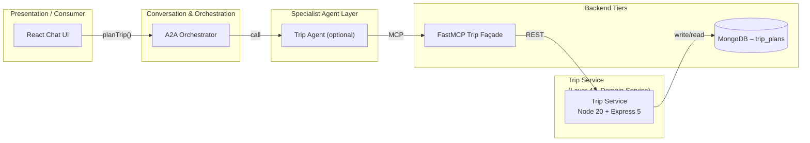

# Trip Service (Node-20 + Express 5) – Design

## 1 Purpose & Scope
The Trip Service provides itinerary storage for the Smart Travel Agency demo. It associates multiple flight and hotel booking IDs under a single **trip plan** document. No inventory logic or cross-domain validation is performed; the service simply stores and retrieves aggregated references.

---
## 2 Position in the Layered Architecture


*The Trip Service is a Layer 4 microservice, accessed via a Layer 5 FastMCP façade. It persists itinerary documents in MongoDB.*

---
## 3 API Contract (OpenAPI 3.1 excerpt)

```yaml
paths:
  /trips:
    get:
      summary: List trip plans for the authenticated user
      security:
        - bearerAuth: []
      parameters:
        - name: page
          in: query
          required: false
          schema:
            type: integer
            minimum: 1
        - name: limit
          in: query
          required: false
          schema:
            type: integer
            minimum: 1
            maximum: 100
      responses:
        "200":
          description: OK
          content:
            application/json:
              schema:
                $ref: "#/components/schemas/TripList"

    post:
      summary: Create a new trip plan
      security:
        - bearerAuth: []
      requestBody:
        required: true
        content:
          application/json:
            schema:
              $ref: "#/components/schemas/TripCreateRequest"
      responses:
        "201":
          description: Created
          content:
            application/json:
              schema:
                $ref: "#/components/schemas/Trip"
        "400":
          $ref: "#/components/responses/BadRequest"
        "401":
          $ref: "#/components/responses/Unauthorized"

  /trips/{tripId}:
    get:
      summary: Get trip plan details
      security:
        - bearerAuth: []
      parameters:
        - name: tripId
          in: path
          required: true
          schema:
            type: string
            format: uuid
      responses:
        "200":
          description: OK
          content:
            application/json:
              schema:
                $ref: "#/components/schemas/Trip"
        "404":
          $ref: "#/components/responses/NotFound"

    delete:
      summary: Delete a trip plan (soft delete)
      security:
        - bearerAuth: []
      parameters:
        - name: tripId
          in: path
          required: true
          schema:
            type: string
            format: uuid
      responses:
        "204":
          description: No Content
        "404":
          $ref: "#/components/responses/NotFound"

components:
  securitySchemes:
    bearerAuth:
      type: http
      scheme: bearer
      bearerFormat: JWT
```
*Only a subset is shown; the full OpenAPI spec will be generated from the implementation.*

---
## 4 MongoDB Data Model – `trip_plans`

| Field               | Type      | Notes                                     |
|---------------------|-----------|-------------------------------------------|
| `_id`               | `ObjectId`| Primary key (`tripId`)                    |
| `userId`            | `ObjectId`| Owner, parsed from JWT subject            |
| `name`              | `string`  | Optional label supplied by client         |
| `flightBookingIds[]`| `string`  | Array of Flight booking document IDs      |
| `hotelBookingIds[]` | `string`  | Array of Hotel booking document IDs       |
| `createdAt`         | `date`    | ISO-8601                                  |
| `updatedAt`         | `date`    | Updated on every modification             |
| `status`            | `string`  | `active` (default) \| `deleted`           |

*No foreign-key or date validation is performed by this service.*

---
## 5 CRUD Workflow

1. **Create** (`POST /trips`)  
   • Extract `userId` from verified JWT.  
   • Insert document with `createdAt` and `updatedAt = now`.  
2. **List** (`GET /trips`)  
   • `find({ userId, status: { $ne: "deleted" } })` with pagination.  
3. **Retrieve** (`GET /trips/{tripId}`)  
   • Ensure `userId` matches owner; else 404.  
4. **Delete** (`DELETE /trips/{tripId}`)  
   • Soft delete: `{ $set: { status: "deleted", updatedAt: now } }`.

---
## 6 Error Handling

| Code | Scenario                       | Payload                                |
|------|--------------------------------|----------------------------------------|
| 400  | Validation failure             | `{ error, details[] }`                 |
| 401  | Missing / invalid JWT          | `{ error }`                            |
| 404  | Trip not found / wrong user    | `{ error }`                            |
| 500  | Uncaught server error          | `{ error, traceId }`                   |

---
## 7 Environment & Configuration Matrix

| Env Var              | Default                | Description                                 |
|----------------------|------------------------|---------------------------------------------|
| `PORT`               | `4003`                 | Port Trip Service listens on                |
| `MONGODB_URI`        | `mongodb://mongo:27017`| Connection string                           |
| `MONGODB_DB`         | `travel`              | Database name                               |
| `LOG_LEVEL`          | `info`                | Logging level (`trace` → `error`)           |
| `CORRELATION_HEADER` | `X-Request-Id`        | Correlation header name                     |

---
## 8 Express Boilerplate Conventions

1. `helmet()` – security headers  
2. `cors()` – allow all origins (demo)  
3. `morgan('combined')` – HTTP access logs  
5. **Correlation-Id** middleware – inject / propagate UUID v4  
6. Built-in `express.json()` body parser  
7. Validation via **Zod** + wrapper middleware  
8. `asyncHandler(fn)` wrapper to forward errors  
9. Centralised error handler → returns the error envelope (see §6)  
10. `notFound` fallback → 404 envelope  

---
## 9 Observability – Logs & Metrics

### Logs
Structured JSON via **pino** with: `time`, `level`, `msg`, `reqId`, `method`, `url`, `status`, `latency_ms`.

### Metrics
`/metrics` (Prometheus exposition, `prom-client`) publishing:  
• `http_requests_total{route,method,status}`  
• `http_request_duration_ms{route}` histogram  
• `process_cpu_seconds_total`, `process_memory_bytes`

### Health
`/healthz` returns `200` with `{ status: "ok", uptime }`.

---
## 10 Glossary & References

- **Itinerary / Trip Plan** – Aggregated list of booking references.
- **FastMCP** – OpenAPI-driven façade (see Layer 5 design).
- **JWT** – JSON Web Token (RFC 7519).