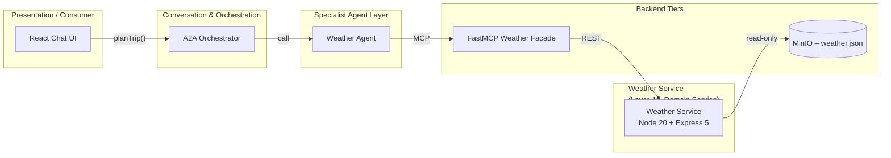

# Weather Service (Node-20 + Express 5) – Design

## 1 Purpose & Scope
The Weather Service provides **weather snapshot retrieval capabilities** for the Smart Travel Agency demo. It exposes REST endpoints consumed by the Weather Agent via the FastMCP façade, and reads immutable weather data from MinIO (`weather.json`).  
**Note:** The Weather Service is strictly read-only—no updates or bookings are supported.

---

## 2 Position in the Layered Architecture



*The Weather Service is a Layer 4 domain microservice, accessed via a Layer 5 FastMCP façade. It reads weather data from MinIO and exposes it via a uniform OpenAPI contract.*

---

## 3 API Contract (OpenAPI 3.1 excerpt)

```yaml
paths:
  /weather:
    get:
      summary: Get weather snapshot(s)
      parameters:
        - name: iata
          in: query
          required: false
          schema:
            type: string
        - name: city
          in: query
          required: false
          schema:
            type: string
        - name: country
          in: query
          required: false
          schema:
            type: string
        - name: date
          in: query
          required: false
          schema:
            type: string
            format: date
      responses:
        "200":
          description: OK
          content:
            application/json:
              schema:
                $ref: "#/components/schemas/WeatherList"
        "404":
          $ref: "#/components/responses/NotFound"
components:
  schemas:
    WeatherList:
      type: array
      items:
        $ref: "#/components/schemas/Weather"
    Weather:
      type: object
      properties:
        weather_id: { type: string, format: uuid }
        location:
          type: object
          properties:
            iata: { type: string }
            city: { type: string }
            country: { type: string }
            lat: { type: number }
            lon: { type: number }
        date: { type: string, format: date }
        summary: { type: string }
        temp_max_c: { type: number }
        temp_min_c: { type: number }
        precip_mm: { type: number }
        precip_prob: { type: number }
        humidity_pct: { type: number }
        wind_kph: { type: number }
        uvi: { type: number }
        icon: { type: string }
  responses:
    NotFound:
      description: Not found
      content:
        application/json:
          schema:
            type: object
            properties:
              error: { type: string }
```
*Full OpenAPI spec to be included in implementation phase.*

---

## 4 MinIO Data Model – `weather.json`

| Field         | Type    | Notes                                         |
|---------------|---------|-----------------------------------------------|
| `weather_id`  | uuid    | Primary key                                   |
| `location`    | object  | `{ iata, city, country, lat, lon }`           |
| `date`        | string  | ISO-8601 date                                 |
| `summary`     | string  | Weather summary (e.g. "Sunny", "Cloudy")      |
| `temp_max_c`  | number  | Max temperature (°C)                          |
| `temp_min_c`  | number  | Min temperature (°C)                          |
| `precip_mm`   | number  | Precipitation (mm)                            |
| `precip_prob` | number  | Precipitation probability (%)                 |
| `humidity_pct`| number  | Humidity (%)                                  |
| `wind_kph`    | number  | Wind speed (kph)                              |
| `uvi`         | number  | UV index                                      |
| `icon`        | string  | Icon descriptor                               |

---

## 5 Search & Filtering Logic

1. Match `location.iata`, `city`, or `country` if provided (case-insensitive).
2. Match `date` if provided.
3. Return all matching weather snapshots.
4. Sort by `date` ascending.

---

## 6 Error Handling

| Code | Scenario                  | Payload                                 |
|------|---------------------------|-----------------------------------------|
| 400  | Missing / invalid params  | `{ error, details[] }`                  |
| 404  | No weather data found     | `{ error }`                             |
| 500  | Uncaught server error     | `{ error, traceId }`                    |

---
 
## 8 Environment & Configuration Matrix

| Env Var              | Default               | Description                                 |
|----------------------|-----------------------|---------------------------------------------|
| `PORT`               | `4000`                | Port Weather Service listens on             |
| `MINIO_ENDPOINT`     | `http://minio:9000`   | URL for MinIO                               |
| `MINIO_ACCESS_KEY`   | `minio`               | Access key                                  |
| `MINIO_SECRET_KEY`   | `minio123`            | Secret key                                  |
| `MINIO_BUCKET`       | `weather`             | Object key / bucket                         |
| `LOG_LEVEL`          | `info`                | Logging level (`trace` → `error`)           |
| `REQUEST_TIMEOUT_MS` | `30000`               | HTTP request timeout (ms)                   |
| `CORRELATION_HEADER` | `X-Request-Id`        | Correlation header name                     |

---

## 9 Express Boilerplate Conventions

1. `helmet()` – security headers
2. `cors()` – allow all origins (demo)
3. `morgan('combined')` – HTTP access logs
4. **Rate-limit** – 100 req/min per IP
5. **Correlation-Id** middleware – inject / propagate UUID v4
6. Built-in `express.json()` body parser
7. Validation via **Zod** + wrapper middleware
8. `asyncHandler(fn)` wrapper to forward errors
9. Centralised error handler → returns the error envelope (see §6)
10. `notFound` fallback → 404 envelope

---

## 10 Observability – Logs & Metrics

### Log Format
Structured JSON via **pino** with: `time`, `level`, `msg`, `reqId`, `method`, `url`, `status`, `latency_ms`.

### Correlation / ID Propagation
Incoming `X-Request-Id` (or generated) is attached to `req.id` and echoed in every log line **and** the response header.

### Metrics
`/metrics` (Prometheus exposition, `prom-client`) publishing:
• `http_requests_total{route,method,status}`
• `http_request_duration_ms{route}` histogram
• `process_cpu_seconds_total`, `process_memory_bytes`

### Health
`/healthz` returns `200` with `{ status: "ok", uptime, minio: "reachable" }`.

---

## 11 Glossary & References

- **IATA** – International Air Transport Association airport codes.
- **FastMCP** – OpenAPI-driven façade (see Layer 5 design).
- **MinIO** – S3-compatible object storage for immutable datasets.
