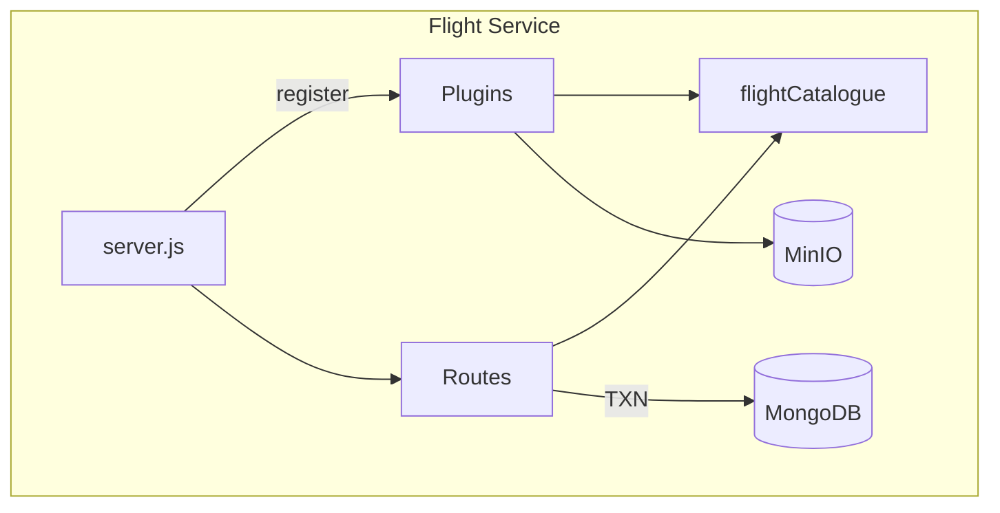

# Flight Service – Implementation Plan (Fastify + Node 20)

## 1  Overview
Build a self-contained microservice under `services/flights` that follows the same patterns as the Authentication service (Fastify, plugins, routes, Jest tests, Docker, k8s).  
**All endpoints require JWT authentication.**

**Base URL** (inside cluster DNS): `/flights-svc`

| Method | Path | Purpose |
| ------ | ---- | ------- |
| GET | /flights | Search flights |
| GET | /flights/:flightId | Flight details |
| POST | /bookings | Create booking |
| GET | /bookings | List user bookings |
| DELETE | /bookings/:bookingId | Cancel booking |
| GET | /healthz | Health probe |

---

## 2  Directory / File Layout
```text
services/flights/
  ├─ package.json
  ├─ Dockerfile
  ├─ k8s/
  │   ├─ deployment.yaml
  │   └─ service.yaml
  ├─ jest.config.js
  ├─ src/
  │   ├─ server.js
  │   ├─ plugins/
  │   │   ├─ jwt.js
  │   │   ├─ mongodb.js
  │   │   └─ minio.js
  │   ├─ models/
  │   │   ├─ flightCatalogue.js
  │   │   └─ booking.js
  │   ├─ routes/
  │   │   ├─ search.js          # GET /flights
  │   │   ├─ details.js         # GET /flights/:flightId
  │   │   ├─ book.js            # POST /bookings
  │   │   ├─ listBookings.js    # GET /bookings
  │   │   └─ cancel.js          # DELETE /bookings/:bookingId
  │   ├─ utils/
  │   │   └─ filterFlights.js
  │   └─ schemas/               # JSON Schemas (optional)
  └─ test/
      ├─ api.e2e.spec.js
      └─ unit/
          └─ filter.spec.js
```

---

## 3  Dependencies
```json
{
  "dependencies": {
    "fastify": "^4",
    "@fastify/jwt": "^7",
    "@fastify/mongodb": "^6",
    "minio": "^8",
    "pino": "^8"
  },
  "devDependencies": {
    "jest": "^30",
    "mongodb-memory-server": "^9",
    "supertest": "^8"
  }
}
```

---

## 4  Fastify Server (`src/server.js`)
1. `Fastify({ logger: pino({ level: process.env.LOG_LEVEL || 'info' }) })`.
2. Register plugins in order:
   - `mongoPlugin` (bookings DB).
   - `minioPlugin` (object storage).
   - `jwtPlugin` (same config as authentication service).
   - `authenticatePlugin` – **registered globally** so every route enforces JWT.
3. In `after()` hook load `flights.json` from MinIO into memory via `flightCatalogue` model.
4. Register routes (no prefix).
5. `/healthz` returns uptime plus Mongo & MinIO reachability.
6. Listen on `PORT` (default **4002**).

---

## 5  Plugins
### `jwt.js`
Identical to auth service, uses `JWT_SECRET`.

### `mongodb.js`
```js
export default {
  forceClose: true,
  url: process.env.MONGODB_URI,
  database: process.env.MONGODB_DB || 'sta'
};
```

### `minio.js`
```js
import fp from 'fastify-plugin';
import { Client } from 'minio';

export default fp(async (fastify) => {
  const client = new Client({
    endPoint: (process.env.MINIO_ENDPOINT || 'minio').replace(/^https?:\/\//, ''),
    port: 9000,
    useSSL: false,
    accessKey: process.env.MINIO_ACCESS_KEY || 'minio',
    secretKey: process.env.MINIO_SECRET_KEY || 'minio123'
  });
  fastify.decorate('minio', client);
});
```

---

## 6  Models
### `flightCatalogue.js`
* Loads `flights.json` at startup into memory.
* Exposes:
  * `search(filters)` – implements design §5 search logic.
  * `findById(id)`.

### `booking.js`
```js
export async function createBooking(fastify, userId, payload) { … }
export async function listBookings(fastify, userId, { status, page, limit }) { … }
export async function cancelBooking(fastify, userId, bookingId) { … }  // includes seat rollback
```

All operations execute inside MongoDB transactions with retry (max 3).

---

## 7  Routes
| File | Method | Path | Description |
|------|--------|------|-------------|
| search.js | GET | /flights | Query params: `origin`, `destination`, `departureDate`, `class` |
| details.js | GET | /flights/:flightId | Returns flight document |
| book.js | POST | /bookings | Body: `flightId`, `class` – returns PNR |
| listBookings.js | GET | /bookings | List current user’s bookings |
| cancel.js | DELETE | /bookings/:bookingId | Cancel booking & restore seat |

Validation uses simple JS checks / JSON Schema (no Zod).

---

## 8  Error Handling
Reuse pattern from authentication service:
```js
fastify.setErrorHandler((err, req, rep) => {
  req.log.error(err);
  const status = err.statusCode || 500;
  rep.status(status).send({ error: err.message });
});
```

---

## 9  Tests
* **E2E Tests** (`test/api.e2e.spec.js`)
  * Spins up Fastify with `MongoMemoryServer`.
  * Mocks MinIO by reading local `minio/flights.json`.
  * Covers: search, book, list, cancel scenarios and JWT auth.
* **Unit Tests**
  * `filter.spec.js` covers search filtering logic.
  * Additional unit tests for booking model collision handling.

---

## 10  Dockerfile
```docker
FROM node:20-alpine AS builder
WORKDIR /app
COPY package.json ./
RUN npm ci

FROM node:20-alpine
WORKDIR /app
COPY --from=builder /app/node_modules ./node_modules
COPY . .
ENV NODE_ENV=production
EXPOSE 4002
CMD ["node", "src/server.js"]
```

---

## 11  Kubernetes Manifests
Deployment and Service located in `k8s/`:

* **Deployment**
  * Replicas: 3
  * Image: `sta-flights-service:latest`
  * Port: 4002
  * Env vars: `PORT`, `MONGODB_URI`, `MINIO_ENDPOINT`, `MINIO_ACCESS_KEY`, `MINIO_SECRET_KEY`, `JWT_SECRET`, `LOG_LEVEL`.
  * Probes: readiness & liveness `GET /healthz`.

* **Service**
  * ClusterIP exposing port 4002.

---

## 12  Implementation Steps
1. Scaffold directories & copy baseline files from authentication service.  
2. Add `package.json` dependencies and `jest.config.js`.  
3. Implement plugins (`jwt`, `mongodb`, `minio`, `authenticate`).  
4. Build `flightCatalogue` loader and search filter utility.  
5. Implement booking model with create, list, cancel logic.  
6. Develop each route incrementally with tests.  
7. Add Dockerfile, run `docker build`, ensure tests pass inside container.  
8. Create k8s manifests; verify with `kubectl apply --dry-run`.  
9. Update README / docs as needed.  
10. CI: integrate into pipeline (future).

---



---

*Approved by stakeholder on 2025-07-02.*